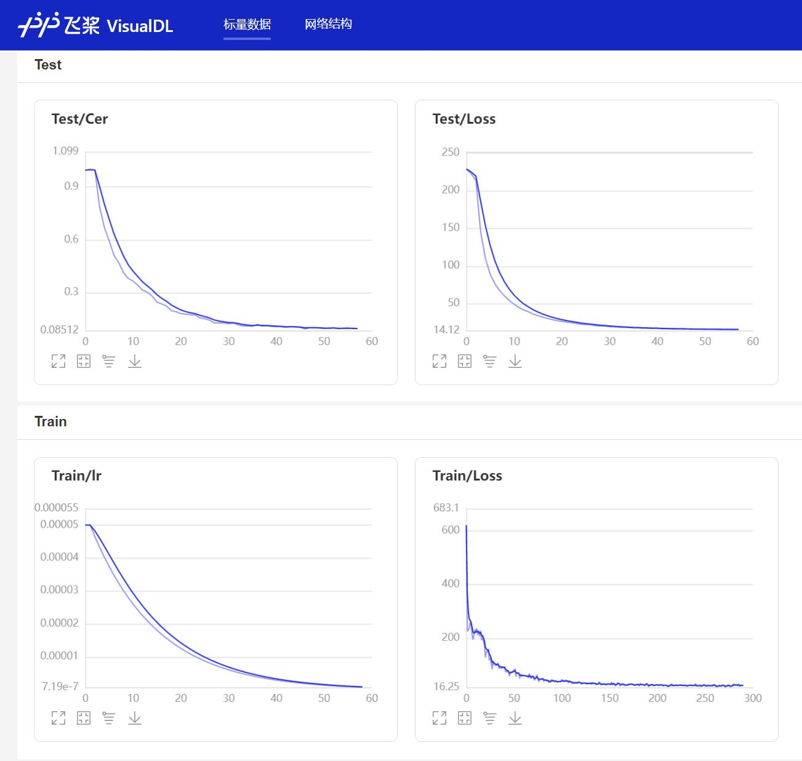

# 训练模型

 - 训练流程，首先是准备数据集，具体看[数据准备](./dataset.md)部分，重点是执行`create_data.py`程序，执行完成之后检查是否在`dataset`目录下生成了`manifest.test`、`manifest.train`、`mean_std.json`、`vocabulary.txt`这四个文件，并确定里面已经包含数据。然后才能往下执行开始训练。

 - 执行训练脚本，开始训练语音识别模型，详细参数请查看`configs`下的配置文件。每训练一轮和每10000个batch都会保存一次模型，模型保存在`models/<use_model>_<feature_method>/epoch_*/`目录下，默认会使用数据增强训练，如何不想使用数据增强，只需要将参数`augment_conf_path`设置为`None`即可。关于数据增强，请查看[数据增强](./augment.md)部分。如果没有关闭测试，在每一轮训练结果之后，都会执行一次测试计算模型在测试集的准确率，注意为了加快训练速度，训练只能用贪心解码。如果模型文件夹下包含`last_model`文件夹，在训练的时候会自动加载里面的模型，这是为了方便中断训练的之后继续训练，无需手动指定，如果手动指定了`resume_model`参数，则以`resume_model`指定的路径优先加载。如果不是原来的数据集或者模型结构，需要删除`last_model`这个文件夹。
```shell
# 单卡训练
CUDA_VISIBLE_DEVICES=0 python train.py
# 多卡训练
CUDA_VISIBLE_DEVICES=0,1 python -m torch.distributed.launch --nproc_per_node=2 train.py
```

训练输出结果如下：
```
----------- 额外配置参数 -----------
augment_conf_path: configs/augmentation.json
configs: configs/config_zh.yml
pretrained_model: None
resume_model: None
save_model_path: models/
------------------------------------------------
----------- 配置文件参数 -----------
ctc_beam_search_decoder: {'alpha': 2.2, 'beta': 4.3, 'beam_size': 300, 'num_processes': 10, 'cutoff_prob': 0.99, 'cutoff_top_n': 40, 'language_model_path': 'lm/zh_giga.no_cna_cmn.prune01244.klm'}
dataset: {'batch_size': 32, 'num_workers': 4, 'min_duration': 0.5, 'max_duration': 20, 'train_manifest': 'dataset/manifest.train', 'test_manifest': 'dataset/manifest.test', 'dataset_vocab': 'dataset/vocabulary.txt', 'mean_std_path': 'dataset/mean_std.json', 'noise_manifest_path': 'dataset/manifest.noise'}
decoder: ctc_beam_search
metrics_type: cer
num_epoch: 65
optimizer: {'learning_rate': '5e-5', 'gamma': 0.93, 'clip_norm': 3.0, 'weight_decay': '1e-6'}
preprocess: {'feature_method': 'fbank', 'n_mels': 80, 'n_mfcc': 40, 'sample_rate': 16000, 'use_dB_normalization': True, 'target_dB': -20}
use_model: deepspeech2
------------------------------------------------
............
[2021-09-17 08:41:16.135825] Train epoch: [24/50], batch: [5900/6349], loss: 3.84609, learning rate: 0.00000688, eta: 10:38:40
[2021-09-17 08:41:38.698795] Train epoch: [24/50], batch: [6000/6349], loss: 0.92967, learning rate: 0.00000688, eta: 8:42:11
[2021-09-17 08:42:04.166192] Train epoch: [24/50], batch: [6100/6349], loss: 2.05670, learning rate: 0.00000688, eta: 10:59:51
[2021-09-17 08:42:26.471328] Train epoch: [24/50], batch: [6200/6349], loss: 3.03502, learning rate: 0.00000688, eta: 11:51:28
[2021-09-17 08:42:50.002897] Train epoch: [24/50], batch: [6300/6349], loss: 2.49653, learning rate: 0.00000688, eta: 12:01:30

 ======================================================================
[2021-09-17 08:43:01.954403] Test batch: [0/65], loss: 13.76276, cer: 0.23105
[2021-09-17 08:43:07.817434] Test epoch: 24, time/epoch: 0:24:30.756875, loss: 6.90274, cer: 0.15213
====================================================================== 
```


 - 在训练过程中，程序会使用VisualDL记录训练结果，可以通过以下的命令启动VisualDL。
```shell
visualdl --logdir=log --host=0.0.0.0
```

 - 然后再浏览器上访问`http://localhost:8040`可以查看结果显示，如下。

